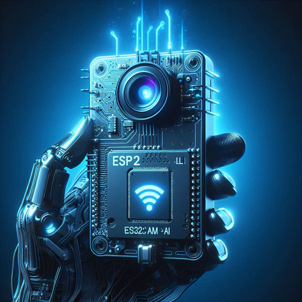

# ESP32-CAM MCP Server

*Transform your ESP32-CAM into a powerful, remotely controllable AI-enabled camera system!*

[](https://github.com/rzeldent/esp32-cam-ai/actions/workflows/main.yml)

[](assets/images/esp32-cam-ai.png)

## Overview

This project transforms an ESP32-CAM into a remotely controllable MCP server that can capture images, control LEDs, manage flash lighting, and provide system diagnostics. The server exposes these capabilities through the Model Context Protocol, making it easy to integrate with AI assistants and automation systems.

Brief: **Use Copilot or other AI digital assistants, like home assistant or Node-Red, to use your ESP32-CAM, getting information (camera, wifi- or system state) or set GPIO's (led, flash)**


## Features

### Hardware Control Tools

- **LED Control**: Turn the ESP32-CAM's built-in LED on/off
- **Flash Control**: Trigger camera flash with configurable duration (5-100ms)
- **Camera Capture**: Take photos with optional flash support (optimized for <4KB base64)
- **Real-time Control**: Instant response to MCP tool calls

### System Monitoring

- **WiFi Status**: Network connection information, signal strength, IP address
- **System Status**: Memory usage, uptime, CPU frequency, SDK version
- **Hardware Info**: Flash storage, sketch size, reset reasons

### Network Features

- **WiFi Auto-reconnection**: Robust connection management with automatic recovery
- **mDNS Support**: Easy device discovery on local network
- **OTA Updates**: Over-the-air firmware updates
- **Watchdog Timer**: System reliability and crash recovery
- **CORS Support**: Cross-Origin Resource Sharing headers for web browser compatibility

### MCP Protocol Support

- **Standard Compliance**: Full MCP 2024-11-05 protocol implementation
- **Tool Schema**: Proper JSON schema validation for all tools
- **Error Handling**: Comprehensive error reporting with proper codes
- **Notifications**: Support for `notifications/initialized`

## Hardware Requirements

### Supported Boards

- **AI-Thinker ESP32-CAM** (Primary target)
- ESP32-CAM TTGO T-Series
- ESP32-CAM M5Stack
- ESP32-CAM Wrover Kit

### Connections

- **Camera**: OV2640 sensor (built-in)
- **LED**: Built-in LED (configurable GPIO)
- **Flash**: Built-in flash LED (configurable GPIO)
- **Power**: 5V via USB or external supply
- **Programming**: FTDI USB-to-Serial adapter or ESP32-CAM motherboard (for initial upload)

### Camera Orientation

**Important**: For optimal image capture, position the ESP32-CAM with the **flash LED facing downward**. This orientation:

- Provides proper lighting direction for subjects
- Prevents flash reflection issues
- Ensures natural-looking illumination in photos
- Matches the expected perspective for most use cases

The camera lens should face the subject while the small flash LED (usually next to the lens) points downward toward the surface or subject being photographed.

## Prerequisites

### Development Environment

- [PlatformIO](https://platformio.org/) IDE or CLI
- [Visual Studio Code](https://code.visualstudio.com/) (recommended)
- ESP32 development framework

### Libraries

- `ArduinoJson` - JSON parsing and generation
- `ESP32 Camera` - Camera functionality (present in ESP32 SDK)
- `Base64` - Image encoding (present in Arduino core)
- Custom MCP library (included)

## Quick Start

### 1. Clone Repository

```bash
git clone https://github.com/yourusername/esp32-cam-ai.git
cd esp32-cam-ai
```

### 2. Configure WiFi Credentials

Create a `.env` file in the project root directory with your WiFi credentials:

```properties
WIFI_SSID=YourWiFiNetwork
WIFI_PASSWORD=YourPassword
```

**Important**: The `.env` file is required for the project to build successfully. The build system automatically reads these credentials and passes them to the firmware during compilation.
There is a template file .env.template present that can be copied to .env and updated with your credentials.

**Note**: For security reasons, the `.env` file should not be committed to version control. Make sure it's included in your `.gitignore` file.

### 3. Build and Upload

```bash
pio run --target upload
```

### 4. Monitor Serial Output

```bash
pio device monitor
```

Look for the IP address in the serial output:

```plaintext
Local IP address: 192.168.1.132

or

mDNS hostname: esp32-7c9ebdf16a10.local
```

Other ways to find the IP address are

- Look in the DHCP server for the IP reservation
- Do a mDNS check for port 80 for _jsonrpc using avahi

## Configuration

### Camera Settings

The project includes multiple camera configurations in `include/camera_config.h`:

```cpp
// Current configuration for AI-Thinker ESP32-CAM
constexpr camera_config_t esp32cam_aithinker_settings = {
    .pin_pwdn = 32,
    .pin_reset = -1,
    .pin_xclk = 0,
    // ... pin configuration
    .frame_size = FRAMESIZE_QVGA,  // 320x240 pixels (optimized for 4KB limit)
    .jpeg_quality = 12,            // Higher = better quality
    .fb_count = 2
};
```

Currently only the AI thinker is enabled. This can in the future be extended to other cameras.

### GPIO Configuration

Configure LED and Flash pins in your build flags:

```ini
build_flags = 
    -DLED_GPIO=33         # Built-in LED pin
    -DLED_ON_LEVEL=LOW    # GPIO level for On
    -DFLASH_GPIO=4        # Flash LED pin
    -DFLASH_ON_LEVEL=HIGH # GPIO level for On
```

## MCP Tools Reference

### LED Control

Controls the ESP32-CAM's built-in LED state.

**Parameters:**

- `state` (required): `"on"` or `"off"`

**Example:**

```json
{
  "jsonrpc": "2.0",
  "method": "tools/call",
  "params": {
    "name": "led",
    "arguments": {"state": "on"}
  }
}
```

### Flash Control

Triggers the camera flash for a specified duration.

**Parameters:**

- `duration` (optional): Duration in milliseconds (5-100ms, default: 50ms)

**Example:**

```json
{
  "jsonrpc": "2.0",
  "method": "tools/call",
  "params": {
    "name": "flash",
    "arguments": {"duration": 75}
  }
}
```

### Camera Capture

Captures a photo from the ESP32-CAM sensor.

**Parameters:**

- `flash` (optional): `"on"` or `"off"` - Use flash during capture

**Response:**

- Text status message
- Base64-encoded JPEG image data (optimized to stay under 4KB)
- Image metadata (size, MIME type)

**Example:**

```json
{
  "jsonrpc": "2.0",
  "method": "tools/call",
  "params": {
    "name": "capture",
    "arguments": {"flash": "on"}
  }
}
```

### WiFi Status

Returns current network connection information.

**No parameters required.**

**Response includes:**

- IP Address
- Signal Strength (dBm)
- MAC Address
- Gateway IP
- DNS Server

### System Status

Provides comprehensive system diagnostics and health monitoring.

**No parameters required.**

**Response includes:**

**Hardware Information:**

- **CPU Frequency**: Operating frequency in MHz (typically 240 MHz)
- **Flash Size**: Total flash memory in bytes (typically 4MB)
- **Flash Speed**: Flash memory clock speed in Hz (typically 40MHz)

**Memory Statistics:**

- **Free Heap**: Currently available RAM in bytes
- **Min Free Heap**: Minimum free heap since boot (memory pressure indicator)
- **Max Alloc Heap**: Maximum contiguous memory block available
- **Sketch Size**: Compiled firmware size in bytes
- **Free Sketch Space**: Available space for firmware updates

**System Information:**

- **Uptime**: Time since last boot in seconds
- **SDK Version**: ESP-IDF framework version
- **Reset Reason**: Why the system last restarted (1=power-on, 2=external reset, 3=software reset, 12=brownout, 14=watchdog)
- **Internal Temperature**: ESP32 chip temperature in Celsius

**Device Status:**

- **Camera Initialized**: Camera readiness status with error codes if failed

**Temperature Monitoring Guidelines:**

- Normal: 40-60°C | Heavy Load: 60-75°C | Warning: >75°C | Critical: >85°C

**Memory Health Indicators:**

- Healthy: >100KB free | Moderate: 50-100KB | High pressure: <50KB | Critical: <30KB

## Usage Examples

### Direct HTTP Requests

```powershell
# Capture image with flash
$body = '{"jsonrpc": "2.0", "id": 1, "method": "tools/call", "params": {"name": "capture", "arguments": {"flash": "on"}}}'
Invoke-RestMethod -Uri "http://192.168.1.132/" -Method Post -Body $body -ContentType "application/json"
```

### Integration with AI Assistants

The MCP server can be integrated with AI assistants that support the Model Context Protocol:

1. **Configure MCP Client** (`mcp.json`):

```json
{
  "servers": {
    "esp32-cam-ai": {
      "type": "http",
      "url": "http://192.168.1.132"
    }
  }
}
```

1. **Use Natural Language Commands**:

   - "Take a picture with the ESP32-CAM"
   - "Turn on the LED"
   - "Check the WiFi status"
   - "Flash the camera"

### Automation Integration

- **Home Assistant**: Create automations triggered by camera captures
- **Node-RED**: Build visual workflows with camera and LED control
- **Custom Applications**: Integrate via standard HTTP requests

## Architecture

### Core Components

```plaintext
┌───────────────────┐    ┌───────────────────┐    ┌───────────────────┐
│    MCP Protocol   │────│   Tool Handlers   │────│   Hardware Layer  │
│                   │    │                   │    │                   │
│ • Initialization  │    │ • LED Control     │    │ • Camera (OV2640) │
│ • Tools List      │    │ • Flash Control   │    │ • GPIO Control    │
│ • Tools Call      │    │ • Capture         │    │ • WiFi Module     │
│ • Notifications   │    │ • Status Check    │    │ • Flash Storage   │
└───────────────────┘    └───────────────────┘    └───────────────────┘
  │                          │                      │
  └──────────────────────────┼──────────────────────┘
              │
          ┌───────────────────┐
          │    Web Server     │
          │                   │
          │ • HTTP Endpoint   │
          │ • JSON Parsing    │
          │ • Error Handling  │
          │ • Response Gen.   │
          └───────────────────┘
```

### Code Structure

```plaintext
esp32-cam-ai/
├── src/
│   └── main.cpp              # Main application code
├── include/
│   └── camera_config.h       # Camera configurations
├── lib/
│   └── mcp/                  # MCP protocol implementation
│       ├── mcp.h
│       └── mcp.cpp
├── .vscode/
│   └── mcp.json             # MCP client configuration
└── platformio.ini           # Build configuration
```

## Reliability Features

### WiFi Management

- **Auto-reconnection**: Automatic retry with exponential backoff
- **Connection monitoring**: Periodic status checks every 5 seconds
- **Recovery mechanisms**: System restart after max failed attempts
- **Event handling**: Proper WiFi event management

### System Stability

- **Watchdog Timer**: 10-second timeout prevents system hangs
- **Memory Management**: Proper cleanup of camera frame buffers
- **Error Handling**: Comprehensive error codes and messages
- **OTA Support**: Remote firmware updates for maintenance

### Camera Management

- **Initialization Checks**: Verify camera before operations
- **Frame Buffer Management**: Proper allocation and cleanup
- **Flash Timing**: Synchronized flash and capture timing
- **Quality Settings**: Configurable resolution and compression

## Troubleshooting

### Common Issues

#### Camera Not Working

```cpp
// Check camera initialization in serial output
Camera init failed with error 0x[code]
```

**Solutions:**

- Verify camera connections
- Check power supply (adequate current)
- Try different camera configurations

#### WiFi Connection Problems

```cpp
// Check WiFi credentials and network
Failed to connect to WiFi. Error code: [code]
```

**Solutions:**

- Verify SSID and password in `.env` file
- Ensure `.env` file exists in project root directory
- Check 2.4GHz network availability (ESP32 doesn't support 5GHz)
- Ensure adequate signal strength
- Verify `.env` file format is correct (no spaces around =)

#### Build Errors

```plaintext
WIFI_SSID is not defined. Please define it in your environment variables or in the code.
WIFI_PASSWORD is not defined. Please define it in your environment variables or in the code.
```

**Solutions:**

- Create a `.env` file in the project root directory
- Add WiFi credentials to `.env` file in the correct format:

```properties
  WIFI_SSID=YourNetworkName
  WIFI_PASSWORD=YourPassword
  ```

- Ensure no spaces around the `=` sign
- Use quotes around values containing special characters or spaces

#### Memory Issues

```cpp
// Monitor heap usage
Free Heap: [bytes] bytes
```

**Solutions:**

- Reduce image quality/resolution to stay under 4KB limit
- Increase frame buffer count
- Check for memory leaks

### Serial Debug Commands

Monitor the serial output for diagnostic information:

```plaintext
CPU Freq: 240 MHz
Free heap: 189092 bytes
WiFi got IP address: 192.168.1.132
Camera initialized: Yes
```

## Advanced Usage

### Custom Camera Settings

Modify `camera_config.h` for specific requirements:

```cpp
// High quality settings (may exceed 4KB limit)
.frame_size = FRAMESIZE_SVGA,  // 800x600
.jpeg_quality = 8,             // Higher quality

// Optimized for 4KB limit
.frame_size = FRAMESIZE_QVGA,  // 320x240
.jpeg_quality = 25,            // Lower quality, smaller files
```

### Adding Custom Tools

Extend the MCP server with additional tools:

1. **Add tool definition** in `handle_tools_list()`
2. **Implement tool handler** function
3. **Register in** `handle_tools_call()`

### Integration Examples

#### Python Client

```python
import requests
import base64
import json

def capture_image(esp32_ip, use_flash=False):
    url = f"http://{esp32_ip}/"
    payload = {
        "jsonrpc": "2.0",
        "id": 1,
        "method": "tools/call",
        "params": {
            "name": "capture",
            "arguments": {"flash": "on" if use_flash else "off"}
        }
    }
    
    response = requests.post(url, json=payload)
    data = response.json()
    
    if "result" in data:
        # Extract base64 image (under 4KB)
        image_data = data["result"]["content"][1]["data"]
        image_bytes = base64.b64decode(image_data)
        
        with open("captured_image.jpg", "wb") as f:
            f.write(image_bytes)
        
        print("Image saved as captured_image.jpg")
    else:
        print(f"Error: {data.get('error', {}).get('message', 'Unknown error')}")

# Usage
capture_image("192.168.1.132", use_flash=True)
```

#### Node.js Integration

```javascript
const axios = require('axios');
const fs = require('fs');

async function captureImage(esp32IP, useFlash = false) {
    const payload = {
        jsonrpc: "2.0",
        id: 1,
        method: "tools/call",
        params: {
            name: "capture",
            arguments: { flash: useFlash ? "on" : "off" }
        }
    };
    
    try {
        const response = await axios.post(`http://${esp32IP}/`, payload);
        const imageData = response.data.result.content[1].data;
        const imageBuffer = Buffer.from(imageData, 'base64');
        
        fs.writeFileSync('captured_image.jpg', imageBuffer);
        console.log('Image saved as captured_image.jpg');
    } catch (error) {
        console.error('Error capturing image:', error.message);
    }
}

// Usage
captureImage('192.168.1.132', true);
```

## Contributing

1. **Fork the repository**
2. **Create feature branch**: `git checkout -b feature/new-tool`
3. **Commit changes**: `git commit -am 'Add new MCP tool'`
4. **Push to branch**: `git push origin feature/new-tool`
5. **Create Pull Request**

### Development Guidelines

- Follow existing code style and patterns
- Add proper error handling for new features
- Update documentation for new tools
- Test thoroughly on actual hardware

## License

This project is licensed under the MIT License - see the [LICENSE](LICENSE) file for details.

## Acknowledgments

- **ESP32 Community** for excellent camera libraries
- **Model Context Protocol** specification authors
- **PlatformIO** for the excellent development environment
- **ArduinoJson** library for efficient JSON handling

## Support

- **Issues**: [GitHub Issues](https://github.com/yourusername/esp32-cam-ai/issues)
- **Discussions**: [GitHub Discussions](https://github.com/yourusername/esp32-cam-ai/discussions)
- **Documentation**: This README and inline code comments

## Performance Metrics

### Typical Performance

- **Image Capture**: ~2-3 seconds for QVGA (320x240) JPEG
- **Tool Response Time**: <500ms for LED/Flash control
- **WiFi Reconnection**: ~10-15 seconds recovery time
- **Memory Usage**: ~200KB free heap during normal operation
- **Network Latency**: <100ms for local network requests

### Resource Usage

- **Flash Storage**: ~1.2MB for compiled firmware
- **RAM Usage**: ~100KB for base functionality + camera buffers
- **CPU Usage**: <5% during idle, ~30% during image capture
- **Network Bandwidth**: ~50KB per image (QVGA quality 12, under 4KB base64)

### Optimization Tips

- **Lower JPEG Quality**: Reduces file size and capture time
- **Smaller Frame Size**: Improves performance and memory usage
- **Reduce Frame Buffer Count**: Saves memory but may affect stability
- **WiFi Power Management**: Balance between performance and power consumption

## Security Considerations

### Network Security

- **Open HTTP Server**: No built-in authentication (add custom authentication if needed)
- **Local Network Access**: Device accessible to all network clients
- **Unencrypted Communication**: Consider HTTPS for sensitive deployments
- **IP Address Exposure**: Device IP visible on network scans

### Physical Security

- **Camera Placement**: Position device appropriately for intended monitoring
- **Access Control**: Secure physical access to device and programming pins
- **Power Supply**: Ensure stable power to prevent data corruption
- **SD Card**: If used, secure against unauthorized access

### Recommended Security Measures

1. **Network Segmentation**: Use dedicated IoT VLAN
2. **Firewall Rules**: Restrict access to specific IP ranges
3. **Regular Updates**: Keep firmware updated via OTA
4. **Access Logging**: Monitor connection attempts
5. **Custom Authentication**: Add API key or token validation

### Privacy Considerations

- **Image Data**: Captured images transmitted as base64 over HTTP (under 4KB)
- **Local Processing**: No cloud storage by default
- **Data Retention**: Images not stored on device (unless explicitly saved)
- **Network Monitoring**: Be aware of network traffic for image transfers

---
